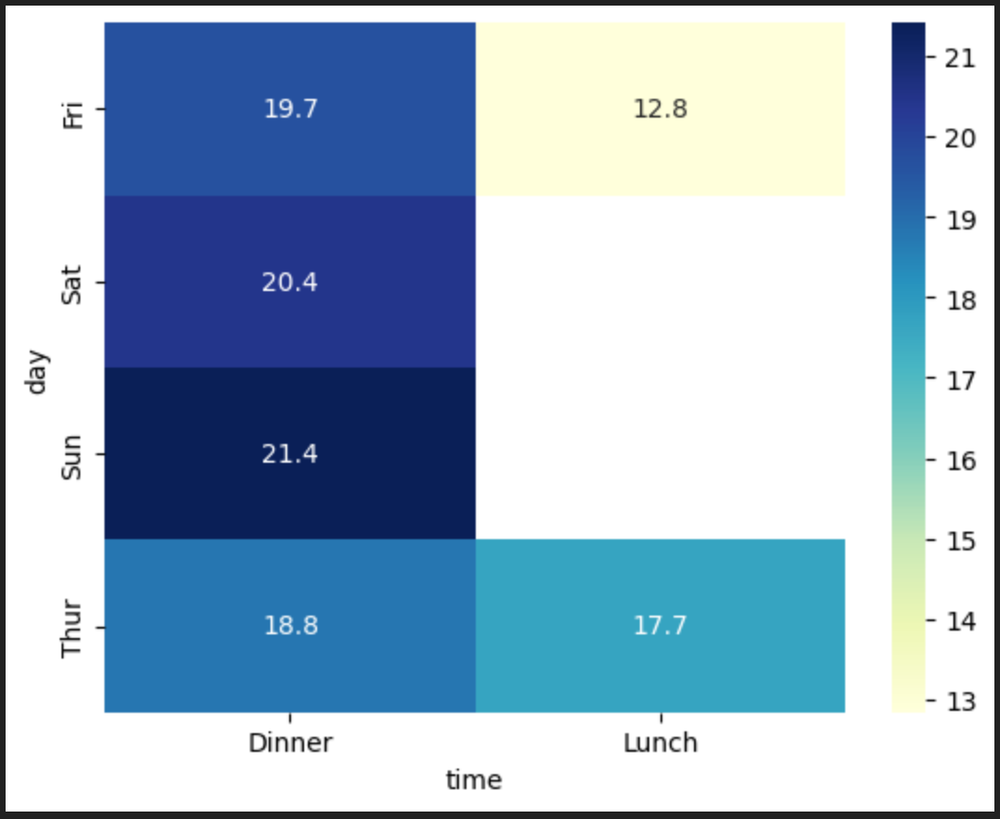
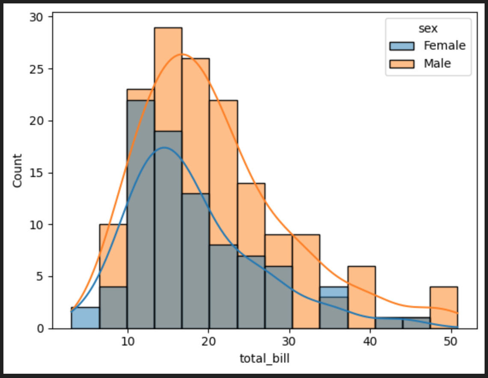
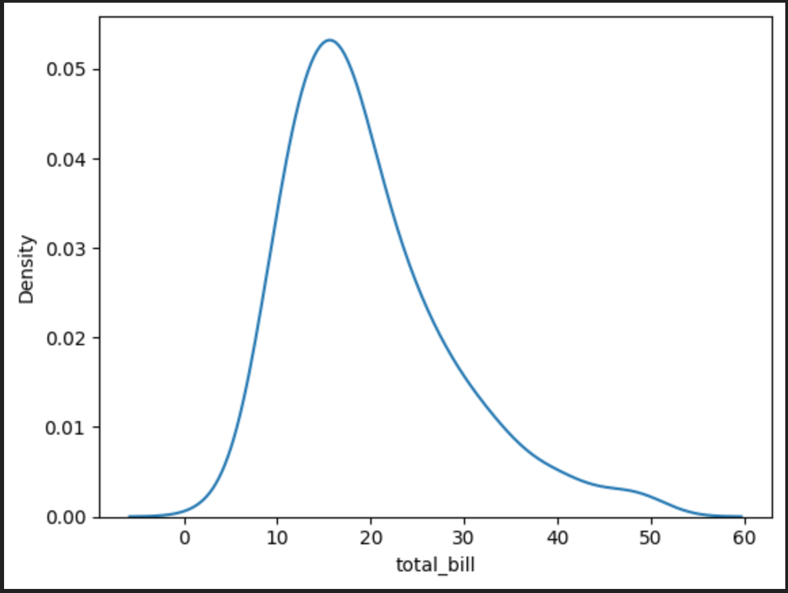
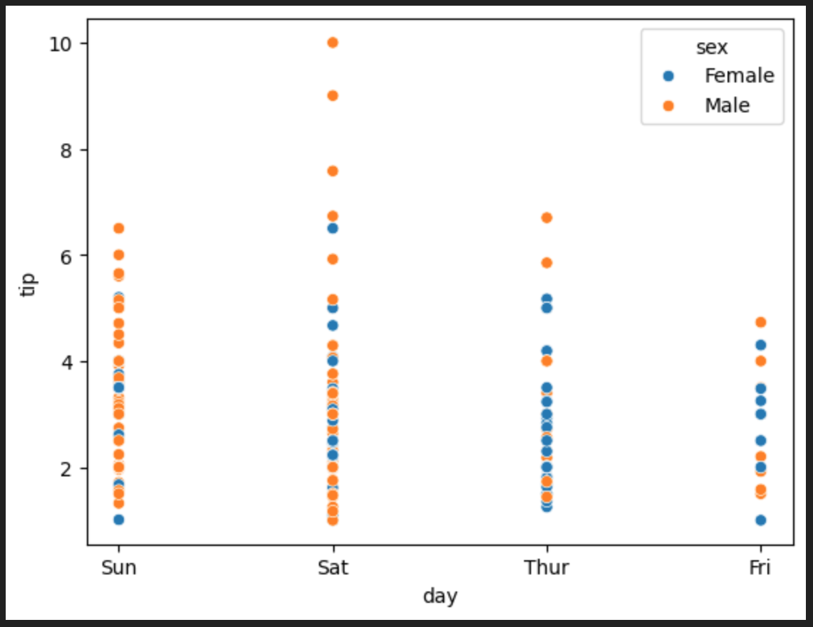
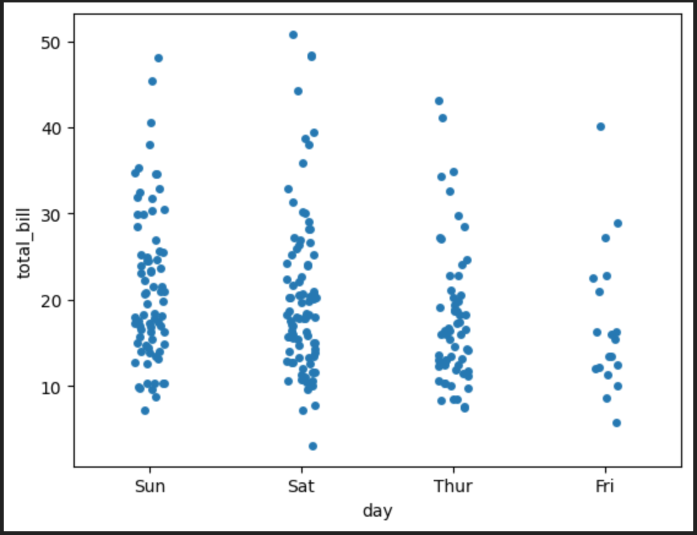

# 📊 Data Analysis & Visualization : 

This project demonstrates data analysis and visualization in Python using multiple libraries:

▫️ Pandas → data cleaning, transformation, and analysis.

▫️ Matplotlib → static charts and plots for quick exploration.

▫️ Seaborn → statistical and advanced visualizations with beautiful themes.

▫️ Plotly → interactive and web-based plots.

▫️ Bokeh → dashboard-ready interactive visualizations.

## 📂 Dataset Description – tips.csv

The dataset contains the following columns:

1️⃣ total_bill → Total bill amount (USD).

2️⃣ tip → Tip amount given (USD).

3️⃣ sex → Gender of the customer (Male/Female).

4️⃣ smoker → Whether the customer is a smoker (Yes/No).

5️⃣ day → Day of the week.

6️⃣ time → Time of day (Lunch/Dinner).

7️⃣ size → Number of people at the table.

---

## 📊 Visualizations

### 1️⃣ bar plot in seaborn


### 2️⃣ heatmap in seaborn


### 3️⃣ histogram in seaborn


### 4️⃣ KDE plot in seaborn


### 5️⃣ line plot in seaborn


### 6️⃣ scatter plot in seaborn


### 7️⃣ strip plot in seaborn


### 8️⃣ violin plot in seaborn


---

## 📝 Insights / Observations

1. Customers dining in larger groups tend to give higher total bills, but not always higher tips proportionally.
2. Male customers on average give slightly higher tips compared to females, though variation exists.
3. Smokers sometimes show different tipping behaviors depending on the day and time.
4. Dinner sessions usually result in higher bills and tips compared to lunch.  

---

## 🛠️ Tools Used
- Python 3.x – Core programming language.
- Pandas – For data manipulation, cleaning, and preprocessing.
- Matplotlib – For static plots (line, bar, scatter, histograms).
- Seaborn – For advanced and statistical visualizations (heatmaps, boxplots, pairplots).
- Plotly – For interactive, zoomable, and web-based visualizations.
- Bokeh – For dashboard-style interactive visualizations.
- Jupyter Notebook / VS Code – For development and experimentation.

---

## 📌 How to Run
1. Clone this repository  
2. Install dependencies:
   ```bash
   pip install pandas seaborn matplotlib
